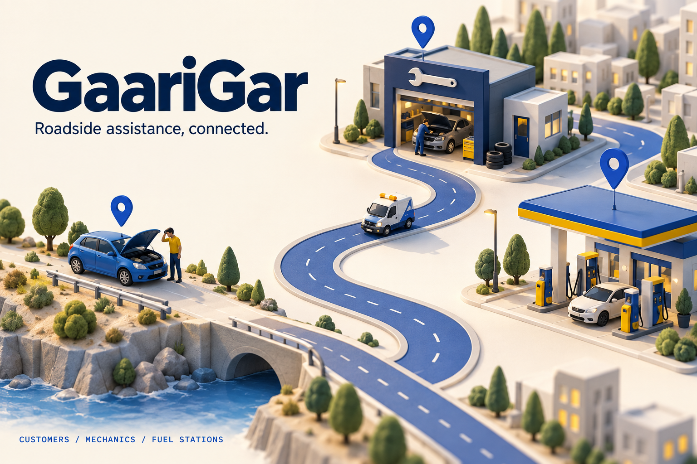
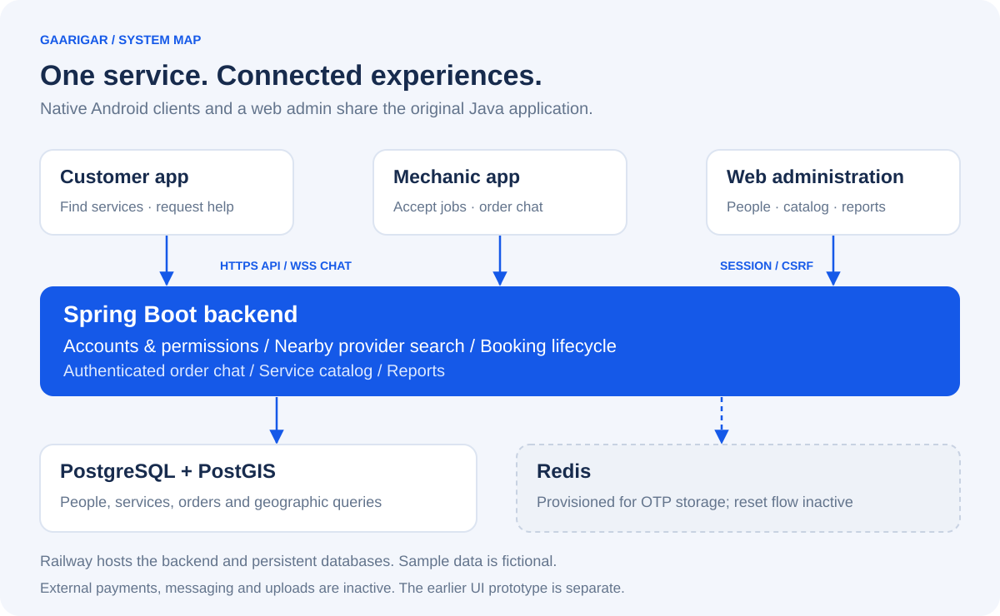

# GaariGar



**First place in my sixth-semester Software Design and Analysis class.**

I built GaariGar in Java to apply object-oriented design and programming patterns to a complete roadside-assistance platform: customer and mechanic Android apps, a Spring Boot backend, and web administration. The project connects customers, mechanics, and fuel stations.

The source is the main engineering evidence; the current Railway demo makes the application easy to explore with fictional data.

**[Android downloads](https://github.com/meeran03/gaarigar/releases/latest)** · **[Live application](https://backend-production-17213.up.railway.app)** · **[Admin panel](https://backend-production-17213.up.railway.app/admin/login)**

## Design you can inspect

| Design choice | Where to look | What it separates |
| --- | --- | --- |
| Controller / service / repository layers | [Customer module](backend/src/main/java/com/gianteyes/gaarigar/customer) | HTTP handling, application behavior, and persistence |
| Polymorphic notification handlers | [NotificationHandler](backend/src/main/java/com/gianteyes/gaarigar/notification/NotificationHandler.java) | A shared contract for email and Firebase implementations |
| Payment-gateway abstraction | [IPaymentGateway](backend/src/main/java/com/gianteyes/gaarigar/payment/paymentGateway/IPaymentGateway.java) | Gateway-facing operations behind an interface |
| Specification-based queries | [BaseSpecification](backend/src/main/java/com/gianteyes/gaarigar/utils/BaseSpecification.java) | Reusable query criteria from service behavior |
| Typed order hierarchy | [OrderModel and order variants](backend/src/main/java/com/gianteyes/gaarigar/Order) | Shared order state and service-specific data |

These are concrete examples of the design focus, not a claim that every legacy component is ideal. See the [design walkthrough](docs/software-design.md).

## What is here

| Component | Location | Purpose |
| --- | --- | --- |
| Backend and web administration | `backend/` | Spring Boot, PostgreSQL/PostGIS, Redis, service requests, provider search, reports, and order chat |
| Customer Android app | `apps/customer/` | Nearby services, bookings, and order tracking |
| Mechanic Android app | `apps/mechanic/` | Provider availability, service requests, and customer chat |
| Earlier mechanic prototype | `apps/mechanic-prototype/` | Preserved original UI prototype; it has no backend integration |

The two connected apps now target the Railway HTTPS/WSS endpoint. Android apps are installed on devices; Railway hosts their backend and the browser-based admin panel.

## How it connects



The customer and mechanic apps use the HTTPS API and authenticated order chat. Browser administration runs in the same Spring Boot service. PostGIS supports nearby-provider queries; Redis is provisioned for OTP storage, whose reset flow is currently inactive. The earlier mechanic prototype is independent.

## Explore the sample environment

- Read-only admin: **+199955501099**, password **GaariGar-sample-2026**.
- Sample customer: **+199955501001**, same sample password.
- Sample mechanic: **+199955502001**, same sample password.
- Sample fuel provider: **+199955503001**, same sample password.

The initial dataset contains 8 customers, 6 mechanics, 3 fuel stations, 4 categories, 6 services, and 36 bookings. Names, phone numbers, locations, and orders are fixtures. Do not enter real personal or payment data.

Administrator credentials are configured separately and are not in this repository. Payments, outbound SMS/email/push, and object uploads are inactive without fresh integration configuration. The sample environment is not an operational roadside assistance service.

## Run and deploy

The backend uses Java 17 and Spring Boot 3.5.16. Its `Dockerfile` builds and runs the tests before producing a non-root runtime image. The deployment configuration is in `backend/railway.json`; the public health endpoint is `/actuator/health`.

Required environment variables: `JDBC_DATABASE_URL`, `PGUSER`, `PGPASSWORD`, `JWT_SECRET` (32+ characters), and `ADMIN_PASSWORD` (16+ characters). Use PostgreSQL with the PostGIS extension. Redis settings are `REDISHOST`, `REDISPORT`, `REDISUSER`, and `REDISPASSWORD`.

Set `SAMPLE_DATA=true` and `SAMPLE_PASSWORD` to enable the one-time sample seed on an empty environment. The seed checks its existing sample customer before adding data; restarting does not duplicate records. `ADMIN_PHONE` defaults to the sample-format administrator number configured in the application.

```sh
cd backend
mvn verify
docker build -t gaarigar .
```

For Android, use the included Gradle wrappers with JDK 11 and SDK 33 (SDK 32 for the prototype). Run `bash gradlew assembleDebug` in an app directory. Google Maps requires your own restricted `MAPS_API_KEY` Gradle property; Firebase requires your own `app/google-services.json`. Those files and keys are intentionally excluded. Login does not require a Firebase configuration. Sample provider locations are near Islamabad (33.6844, 73.0479); nearby results depend on device location. APKs are debug builds for evaluation, not Play Store releases.

## Acceptance checks

```sh
GAARIGAR_TEST_URL=https://backend-production-17213.up.railway.app python3 verification/api_smoke.py
GAARIGAR_TEST_URL=https://backend-production-17213.up.railway.app node verification/chat_smoke.mjs
```

Set `GAARIGAR_TEST_BOOKING=1` for the API check to create and complete one fictional cash booking. The chat check uses Node 22+ and sends a sample message, verifies server-controlled sender identity, and rejects a non-participant subscription.

## Publication and hosting notes

This repository starts with a fresh history because the old private repositories contained embedded credentials and service account files. No old database or customer records were migrated. The original repositories remain private.

The migration updates Spring Boot 2.7 to 3.5, Jakarta imports and Hibernate spatial integration; moves credentials to environment configuration; adds authentication and ownership checks; protects web forms against CSRF; provides a read-only admin viewer; fixes meter-based nearby search and cancelled-order reporting; and supplies sample data and CI builds.

A broader production review and fresh provider configuration are required before onboarding real customers. See [migration status](docs/migration-status.md) for verified behavior and remaining integration work.

Original project: Giant Eyes / GaariGar. Course project and current deployment: Muhammad Meeran. No new license grant is asserted for the original contributors' work.

[Artwork and editable diagrams](docs/assets/README.md). The cover is a conceptual illustration, not an application screenshot.
